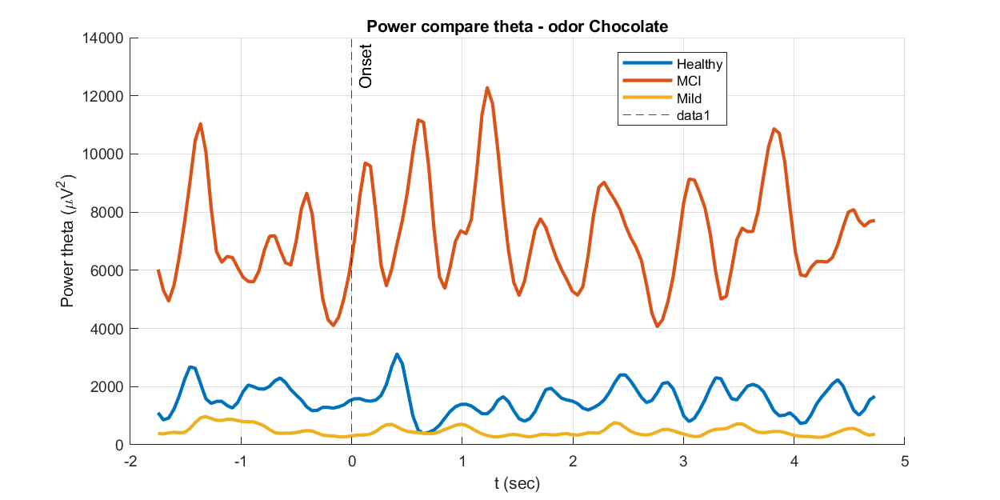
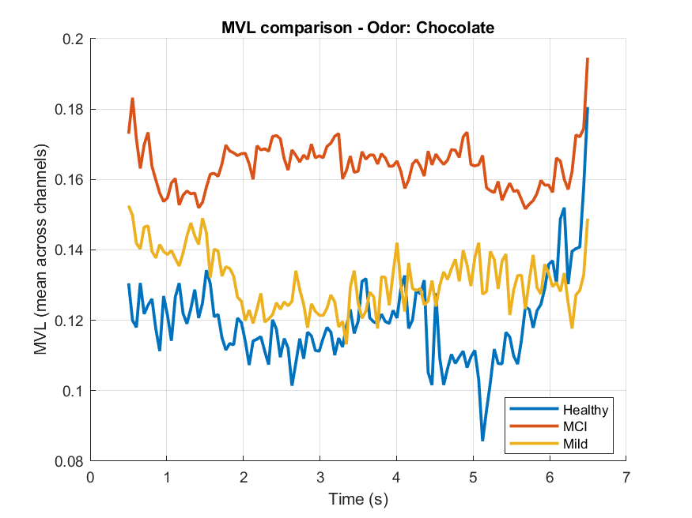

# EEG Power and Phase–Amplitude Coupling during Olfactory Stimulation


A two-phase EEG signal-processing study of olfactory-evoked dynamics in Healthy Control, Mild Cognitive Impairment (MCI), and Mild Alzheimer's Disease groups. Phase 1 examines event-related spectral power; Phase 2 measures theta–gamma phase–amplitude coupling (PAC).

> [!CAUTION]
> This is an exploratory course project, not a clinical diagnostic model. Group-level observations in the generated figures do not establish a validated Alzheimer's biomarker.

## Analysis pipeline

| Phase | Method | Configuration | Primary outputs |
|---|---|---|---|
| 1 | Short-Time Fourier Transform | theta 4–8 Hz; gamma 30–50 Hz; 0.5 s window | odor-locked power curves and group comparisons |
| 2 | Hilbert-based PAC | theta phase 4–8 Hz; gamma amplitude 30–50 Hz; 1 s windows; 95% overlap | MVL time courses, Tort MI, polar plots, channel/group comparisons |

The analysis uses Chocolate and Rose event markers and consistent $-2$ to $+5$ s epochs. PAC is computed per epoch, summarized by subject/odor/electrode, and then compared across groups.

## Example outputs

| Theta-power comparison | PAC comparison |
|:---:|:---:|
|  |  |

## Repository structure

```text
.
├── Phase1/
│   ├── Functions/       # Preprocessing, STFT, and plotting functions
│   ├── PreProcessed/    # EEGLAB .set/.fdt inputs used in the course snapshot
│   ├── Results/         # Saved power summaries and figures
│   └── main.m
├── Phase2/
│   ├── Functions/       # MVL, MI, filtering, and plotting functions
│   ├── plots/           # Subject/channel and group figures
│   ├── PAC_*.mat        # Derived PAC summaries
│   └── mainn.m
└── README.md
```

## Requirements

- MATLAB R2023b or a compatible release
- Signal Processing Toolbox
- Statistics and Machine Learning Toolbox
- [EEGLAB](https://sccn.ucsd.edu/eeglab/)

Add EEGLAB to the MATLAB path before running the scripts. The repository code no longer assumes a personal absolute path.

## Run

```matlab
cd Phase1
run('main.m')
```

Then, for PAC:

```matlab
cd Phase2
mainn
```

Both entry points resolve their own `Functions/` directory. Generated figures are written to `Phase1/Results/` and `Phase2/plots/`.

## Data and reproducibility

The current course snapshot contains selected preprocessed EEGLAB files and derived results, not the full original cohort. The repository owner has confirmed the required permission to publish this snapshot. That confirmation does not automatically grant downstream users permission to redistribute or reuse participant-level data; reusers must follow the original dataset, consent, and institutional terms.

## Course context

- **Course:** Signals and Systems
- **Institution:** Sharif University of Technology
- **Instructor:** Prof. Hamid K. Aghajan
- **Term:** Spring 2025

## Contributors

- Moein Yousefinia
- Kimia Fakheri
- Matin M. Babaei

No open-source license is granted by this repository unless a license file is added explicitly.
